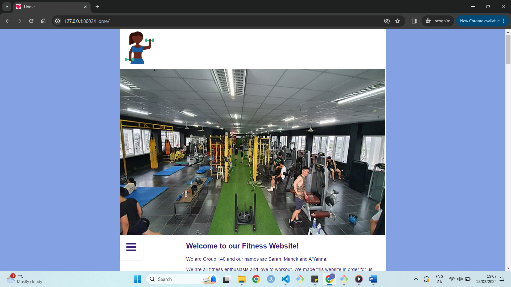

# Group 140 CA229 Group Project

## Description
This is our Django website for CA229 group assignment. Our website is centred around core, upperbody and lowerbody workouts. We also have our [magic page](simple_test_project01/simple_test_root/simple_test_site/Templates/pages/magic.html), which is mainly implemented in our file [views.py](simple_test_project01/simple_test_root/pages/views.py)

## Badges
On some READMEs, you may see small images that convey metadata, such as whether or not all the tests are passing for the project. You can use Shields to add some to your README. Many services also have instructions for adding a badge.

## Visuals - Our website demo
A screenshot of our home page can be seen below: 

## Installation
To install our project, follow these steps:
1. Clone this repository.
2. Navigate to the project directory.
3. Install dependencies with `pip install -r requirements.txt`.
4. Run migrations with `python manage.py migrate`.

## Usage
To run the project locally, execute `python manage.py runserver` and visit `http://localhost:8000` in your browser.

## Support
If you have any issues with our website please feel free to contact us at any of our emails below:
- sarah.ohanlon24@mail.dcu.ie
- mahek.hemani2@mail.dcu.ie
- ayanna.rouse2@mail.dcu.ie

## Roadmap
We are very happy with our website design and features!

## Contributing
we are currently not open to contribution.

## Authors and Acknowledgment
This project was created and designed by:
- Sarah O'Hanlon
- A'Yanna Rouse
- Mahek Hemani

## Project Status
The project is nearing completion and is currently in the final testing phase.
